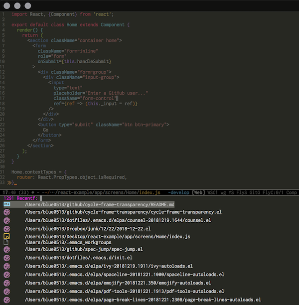
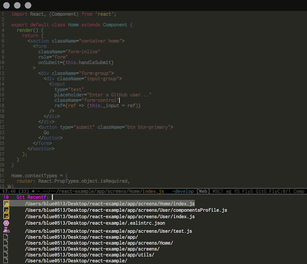

# Git Counsel Recentf

It's `counsel-recentf` enhancement.  
List recently opened files only under **the current Git project** via ivy interface!

## How It Works

normal `counsel-recentf` can list all the recent opened files.



`git-counsel-recentf` can only list the files under the current Git project.



## Motivation

`counsel-recentf` can list recent opened files, even though the files are out of the current project.  
But actually what we want to open are the files of **the current Git project**.

This package can filter the files if they are under the current Git project.

## Usage

In your `init.el`, write code as bellow.

```elisp
(add-to-list 'load-path "YOUR PATH")
(require 'git-counsel-recentf)
```

Call `M-x git-counsel-recentf` under Git controlled projects.
